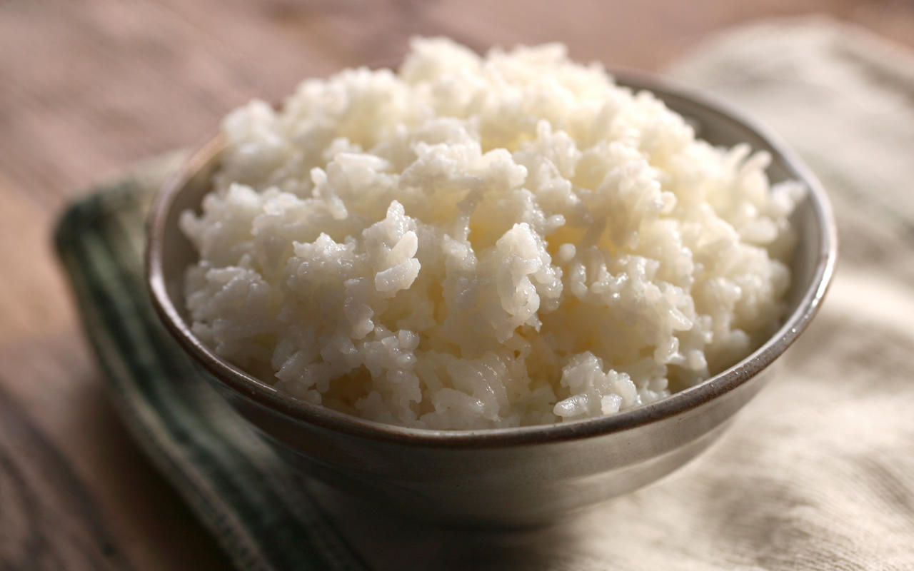
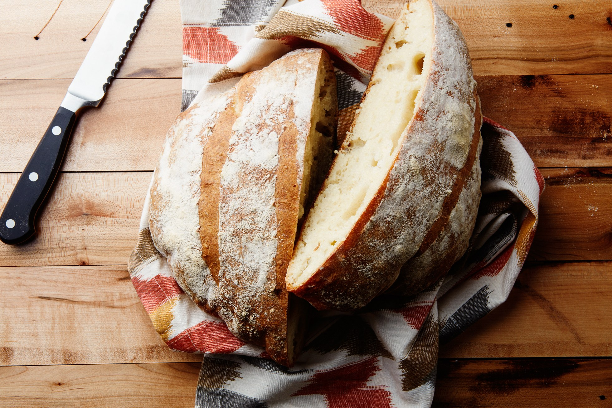
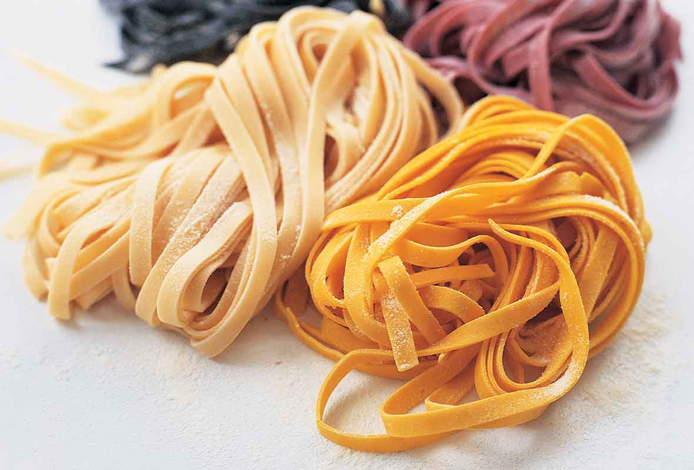

# Staple Starches of the World

Melanie DeJong

In-Class Exercise 5: Information Architecture and Markdown

1-31-18

## Rice, Bread, and Pasta

What could rice, bread, and pasta possibly have in common? Is it, perhaps, that they are all delicious? That nutritionalists often tell you to eat less of them? That they're white-ish and squishy? All of those things are, of course, true. But that is not all. Though rice, bread, and pasta are all have their own histories, preparations, and nutritional values, they share a critical common function in many different cultures throughout the world: that of staple starches. This means that they make up a large portion of people's diets, providing a plentiful supply of carbohydrates and calories. With this common function in mind, let us look into how these staple starches came to be, how they're made, and what they can do for our bodies, starting with the most ancient. 

## Rice

### History

Wild rice, from which the crop was developed, may have its native range in Australia. Chinese legends attribute the domestication of rice to Shennong, the legendary emperor of China and inventor of Chinese agriculture. Genetic evidence has shown that rice originates from a single domestication 8,200–13,500 years ago in the Pearl River valley region of Ancient China. Previously, archaeological evidence had suggested that rice was domesticated in the Yangtze River valley region in China.

From East Asia, rice was spread to Southeast and South Asia. Rice was introduced to Europe through Western Asia, and to the Americas through European colonization.

There have been many debates on the origins of the domesticated rice. Genetic evidence published in the Proceedings of the National Academy of Sciences of the United States of America (PNAS) shows that all forms of Asian rice, both indica and japonica, spring from a single domestication that occurred 8,200–13,500 years ago in China of the wild rice Oryza rufipogon. A 2012 study published in Nature, through a map of rice genome variation, indicated that the domestication of rice occurred in the Pearl River valley region of China based on the genetic evidence. From East Asia, rice was spread to South and Southeast Asia. Before this research, the commonly accepted view, based on archaeological evidence, is that rice was first domesticated in the region of the Yangtze River valley in China.

Morphological studies of rice phytoliths from the Diaotonghuan archaeological site clearly show the transition from the collection of wild rice to the cultivation of domesticated rice. The large number of wild rice phytoliths at the Diaotonghuan level dating from 12,000–11,000 BP indicates that wild rice collection was part of the local means of subsistence. Changes in the morphology of Diaotonghuan phytoliths dating from 10,000–8,000 BP show that rice had by this time been domesticated. Soon afterwards the two major varieties of indica and japonica rice were being grown in Central China. In the late 3rd millennium BC, there was a rapid expansion of rice cultivation into mainland Southeast Asia and westwards across India and Nepal.

In 2003, Korean archaeologists claimed to have discovered the world's oldest domesticated rice. Their 15,000-year-old age challenges the accepted view that rice cultivation originated in China about 12,000 years ago. These findings were received by academia with strong skepticism, and the results and their publicizing has been cited as being driven by a combination of nationalist and regional interests. In 2011, a combined effort by the Stanford University, New York University, Washington University in St. Louis, and Purdue University has provided the strongest evidence yet that there is only one single origin of domesticated rice, in the Yangtze Valley of China.

Rice spread to the Middle East where, according to Zohary and Hopf (2000, p. 91), O. sativa was recovered from a grave at Susa in Iran (dated to the 1st century AD).

### Preparation

The varieties of rice are typically classified as long-, medium-, and short-grained. The grains of long-grain rice (high in amylose) tend to remain intact after cooking; medium-grain rice (high in amylopectin) becomes more sticky. Medium-grain rice is used for sweet dishes, for risotto in Italy, and many rice dishes, such as arròs negre, in Spain. Some varieties of long-grain rice that are high in amylopectin, known as Thai Sticky rice, are usually steamed. A stickier medium-grain rice is used for sushi; the stickiness allows rice to hold its shape when molded. Medium-grain rice is used extensively in Japan, including to accompany savoury dishes, where it is usually served plain in a separate dish. Short-grain rice is often used for rice pudding.

Instant rice differs from parboiled rice in that it is fully cooked and then dried, though there is a significant degradation in taste and texture. Rice flour and starch often are used in batters and breadings to increase crispiness.

Rice is typically rinsed before cooking to remove excess starch. Rice produced in the US is usually fortified with vitamins and minerals, and rinsing will result in a loss of nutrients. Rice may be rinsed repeatedly until the rinse water is clear to improve the texture and taste.

Rice may be soaked to decrease cooking time, conserve fuel, minimize exposure to high temperature, and reduce stickiness. For some varieties, soaking improves the texture of the cooked rice by increasing expansion of the grains. Rice may be soaked for 30 minutes up to several hours.

Brown rice may be soaked in warm water for 20 hours to stimulate germination. This process, called germinated brown rice (GBR), activates enzymes and enhances amino acids including gamma-aminobutyric acid to improve the nutritional value of brown rice. This method is a result of research carried out for the United Nations International Year of Rice.

Rice is cooked by boiling or steaming, and absorbs water during cooking. With the absorption method, rice may be cooked in a volume of water similar to the volume of rice. With the rapid-boil method, rice may be cooked in a large quantity of water which is drained before serving. Rapid-boil preparation is not desirable with enriched rice, as much of the enrichment additives are lost when the water is discarded. Electric rice cookers, popular in Asia and Latin America, simplify the process of cooking rice. Rice (or any other grain) is sometimes quickly fried in oil or fat before boiling (for example saffron rice or risotto); this makes the cooked rice less sticky, and is a cooking style commonly called pilaf in Iran and Afghanistan or biryani (Dam-pukhtak) in India and Pakistan.

### Nutritional Value

Cooked, unenriched, white, long-grained rice is composed of 68% water, 28% carbohydrates, 3% protein, and negligible fat. In a 100 gram serving, it provides 130 calories and contains no micronutrients in significant amounts, with all less than 10% of the Daily Value (DV) (table). Cooked, white, short-grained rice also provides 130 calories and contains moderate amounts of B vitamins, iron, and manganese (10–17% DV) per 100 gram amount (table).

A detailed analysis of nutrient content of rice suggests that the nutrition value of rice varies based on a number of factors. It depends on the strain of rice, that is between white, brown, red, and black (or purple) varieties of rice – each prevalent in different parts of the world. It also depends on nutrient quality of the soil rice is grown in, whether and how the rice is polished or processed, the manner it is enriched, and how it is prepared before consumption.

Rice is the staple food of over half the world's population. It is the predominant dietary energy source for 17 countries in Asia and the Pacific, 9 countries in North and South America and 8 countries in Africa. Rice provides 20% of the world’s dietary energy supply, while wheat supplies 19% and maize (corn) 5%.

## Bread

### History

Bread is one of the oldest prepared foods. Evidence from 30,000 years ago in Europe revealed starch residue on rocks used for pounding plants. It is possible that during this time, starch extract from the roots of plants, such as cattails and ferns, was spread on a flat rock, placed over a fire and cooked into a primitive form of flatbread. Around 10,000 BC, with the dawn of the Neolithic age and the spread of agriculture, grains became the mainstay of making bread. Yeast spores are ubiquitous, including on the surface of cereal grains, so any dough left to rest leavens naturally.

There were multiple sources of leavening available for early bread. Airborne yeasts could be harnessed by leaving uncooked dough exposed to air for some time before cooking. Pliny the Elder reported that the Gauls and Iberians used the foam skimmed from beer called barm to produce "a lighter kind of bread than other peoples" such as barm cake. Parts of the ancient world that drank wine instead of beer used a paste composed of grape juice and flour that was allowed to begin fermenting, or wheat bran steeped in wine, as a source for yeast. The most common source of leavening was to retain a piece of dough from the previous day to use as a form of sourdough starter, as Pliny also reported.

In 1961 the Chorleywood bread process was developed, which used the intense mechanical working of dough to dramatically reduce the fermentation period and the time taken to produce a loaf. The process, whose high-energy mixing allows for the use of lower protein grain, is now widely used around the world in large factories. As a result, bread can be produced very quickly and at low costs to the manufacturer and the consumer. However, there has been some criticism of the effect on nutritional value.

### Preparation

Doughs are usually baked, but in some cuisines breads are steamed (e.g., mantou), fried (e.g., puri), or baked on an unoiled frying pan (e.g., tortillas). It may be leavened or unleavened (e.g. matzo). Salt, fat and leavening agents such as yeast and baking soda are common ingredients, though bread may contain other ingredients, such as milk, egg, sugar, spice, fruit such as raisins, vegetables such as onion, nuts such as walnut or seeds such as poppy.

Professional bread recipes are stated using the baker's percentage notation. The amount of flour is denoted to be 100%, and the other ingredients are expressed as a percentage of that amount by weight. Measurement by weight is more accurate and consistent than measurement by volume, particularly for dry ingredients. The proportion of water to flour is the most important measurement in a bread recipe, as it affects texture and crumb the most. Hard wheat flours absorb about 62% water, while softer wheat flours absorb about 56%. Common table breads made from these doughs result in a finely textured, light bread. Most artisan bread formulas contain anywhere from 60 to 75% water. In yeast breads, the higher water percentages result in more CO2 bubbles and a coarser bread crumb. One pound (450 g) of flour yields a standard loaf of bread or two French loaves.

Calcium propionate is commonly added by commercial bakeries to retard the growth of molds.

Flour is grain ground to a powdery consistency. Flour provides the primary structure, starch and protein to the final baked bread. The protein content of the flour is the best indicator of the quality of the bread dough and the finished bread. While bread can be made from all-purpose wheat flour, a specialty bread flour, containing more protein (12–14%), is recommended for high-quality bread. If one uses a flour with a lower protein content (9–11%) to produce bread, a shorter mixing time is required to develop gluten strength properly. An extended mixing time leads to oxidization of the dough, which gives the finished product a whiter crumb, instead of the cream color preferred by most artisan bakers.

Wheat flour, in addition to its starch, contains three water-soluble protein groups (albumin, globulin, and proteoses) and two water-insoluble protein groups (glutenin and gliadin). When flour is mixed with water, the water-soluble proteins dissolve, leaving the glutenin and gliadin to form the structure of the resulting bread. When relatively dry dough is worked by kneading, or wet dough is allowed to rise for a long time (see no-knead bread), the glutenin forms strands of long, thin, chainlike molecules, while the shorter gliadin forms bridges between the strands of glutenin. The resulting networks of strands produced by these two proteins are known as gluten. Gluten development improves if the dough is allowed to autolyse.

Water, or some other liquid, is used to form the flour into a paste or dough. The weight of liquid required varies between recipes, but a ratio of 3 parts liquid to 5 parts flour is common for yeast breads. Recipes that use steam as the primary leavening method may have a liquid content in excess of 1 part liquid to 1 part flour. Instead of water, recipes may use liquids such as milk or other dairy products (including buttermilk or yoghurt), fruit juice, or eggs. These contribute additional sweeteners, fats, or leavening components, as well as water.

Fats, such as butter, vegetable oils, lard, or that contained in eggs, affect the development of gluten in breads by coating and lubricating the individual strands of protein. They also help to hold the structure together. If too much fat is included in a bread dough, the lubrication effect causes the protein structures to divide. A fat content of approximately 3% by weight is the concentration that produces the greatest leavening action. In addition to their effects on leavening, fats also serve to tenderize breads and preserve freshness.

Bread improvers and dough conditioners are often used in producing commercial breads to reduce the time needed for rising and to improve texture and volume. The substances used may be oxidising agents to strengthen the dough or reducing agents to develop gluten and reduce mixing time, emulsifiers to strengthen the dough or to provide other properties such as making slicing easier, or enzymes to increase gas production.

Salt is often added to enhance flavor and restrict yeast activity. It also affects the crumb and the overall texture by stabilizing and strengthening the gluten. Some artisan bakers forego early addition of salt to the dough, whether wholemeal or refined, and wait until after a 20-minute rest to allow the dough to autolyse.

### Nutritional Value

Bread supplies a significant portion of the nutrients required for growth, maintenance of health and well-being. It is an excellent source of proteins, vitamins, minerals, fibre and complex carbohydrates. It is also low in fat and cholesterol. Bread is quite bulky so it takes longer to digest and is therefore more satisfying and less fattening than the fats, sugars and alcohols commonly consumed in excess. All breads are nutritious, and the differences between them in nutritional value are not significant if we eat a balanced diet.

White bread has approximately the same carbohydrate and protein content as wholemeal bread, contains soluble and insoluble dietary fibre, and a good percentage of the whole wheat nutrients. It is made from unbleached flour made from the inner 78% of the wheat grain. If you prefer white bread to wholegrain breads, you can get your extra fibre from other wholegrain foods such as breakfast cereals, wholemeal crackers and biscuits.

In New Zealand wholemeal bread is made from at least 90% wholemeal flour. White flour may be added to wholemeal flour to make wheatmeal products.
It is often added to improve the baking quality of breads made with wholemeal flour because of its gluten protein content.

Wheatmeal breads are not subject to food regulations and so the quantity of wholemeal flour used may vary. Nutritional comparisons are therefore diffcult to make.

## Pasta

### History

In the 1st century AD writings of Horace, lagana (singular: laganum) were fine sheets of fried dough and were an everyday foodstuff. Writing in the 2nd century Athenaeus of Naucratis provides a recipe for lagana which he attributes to the 1st century Chrysippus of Tyana: sheets of dough made of wheat flour and the juice of crushed lettuce, then flavoured with spices and deep-fried in oil. An early 5th century cookbook describes a dish called lagana that consisted of layers of dough with meat stuffing, a possible ancestor of modern-day lasagna. However, the method of cooking these sheets of dough does not correspond to our modern definition of either a fresh or dry pasta product, which only had similar basic ingredients and perhaps the shape. The first concrete information concerning pasta products in Italy dates from the 13th or 14th century.

Historians have noted several lexical milestones relevant to pasta, none of which changes these basic characteristics. For example, the works of the 2nd century AD Greek physician Galen mention itrion, homogeneous compounds made of flour and water. The Jerusalem Talmud records that itrium, a kind of boiled dough, was common in Palestine from the 3rd to 5th centuries AD. A dictionary compiled by the 9th century Arab physician and lexicographer Isho bar Ali defines itriyya, the Arabic cognate, as string-like shapes made of semolina and dried before cooking. The geographical text of Muhammad al-Idrisi, compiled for the Norman King of Sicily Roger II in 1154 mentions itriyya manufactured and exported from Norman Sicily:

West of Termini there is a delightful settlement called Trabia. Its ever-flowing streams propel a number of mills. Here there are huge buildings in the countryside where they make vast quantities of itriyya which is exported everywhere: to Calabria, to Muslim and Christian countries. Very many shiploads are sent.

One form of itriyya with a long history is laganum (plural lagana), which in Latin refers to a thin sheet of dough, and gives rise to Italian lasagna.

In North Africa, a food similar to pasta, known as couscous, has been eaten for centuries. However, it lacks the distinguishing malleable nature of pasta, couscous being more akin to droplets of dough. At first, dry pasta was a luxury item in Italy because of high labor costs; durum wheat semolina had to be kneaded for a long time.

There is a legend of Marco Polo importing pasta from China which originated with the Macaroni Journal, published by an association of food industries with the goal of promoting pasta in the United States. Rustichello da Pisa writes in his Travels that Marco Polo described a food similar to "lagana". Jeffrey Steingarten asserts that Arabs introduced pasta in the Emirate of Sicily in the ninth century, mentioning also that traces of pasta have been found in ancient Greece and that Jane Grigson believed the Marco Polo story to have originated in the 1920s or 30s in an advertisement for a Canadian spaghetti company.

In Greek mythology, it is believed that the god Hephaestus invented a device that made strings of dough. This was the earliest reference to a pasta maker.

In the 14th and 15th centuries, dried pasta became popular for its easy storage. This allowed people to store pasta on ships when exploring the New World. A century later, pasta was present around the globe during the voyages of discovery.

The invention of the first tomato sauces dates from the late 18th century: the first written record of pasta with tomato sauce can be found in the 1790 cookbook L'Apicio Moderno by Roman chef Francesco Leonardi. Before tomato sauce was introduced, pasta was eaten dry with the fingers; the liquid sauce demanded the use of a fork.

Pasta manufacturing machines were made since the 1600s across the coast of Sanremo. The extrusion press produced large amounts of uniform pastas. The consistency of shapes and texture of the pasta manufactured by the extrusion press is believed to be superior to handmade pasta. This technology spread to other areas including Genoa, Apulia, Brindisi, Bari, and Tuscany. By 1867, Buitoni Company in Sansepolcro, Tuscany in the upper Tiber Valley became one of the most successful and well-known pasta manufacturers in the world.

### Preparation

Ingredients to make pasta dough include semolina flour, egg, salt and water. Flour is first mounded on a flat surface and then a well in the pile of flour is created. Egg is then poured into the well and a fork is used to mix the egg and flour. There are a variety of ways to shape the sheets of pasta depending on the type required. The most popular types include penne, spaghetti, and macaroni.

Kitchen pasta machines, also called pasta makers, are popular with cooks who make large amounts of fresh pasta. The cook feeds sheets of pasta dough into the machine by hand, and by turning a hand crank, extrudes the pasta through a machine 'comb' that shapes the pasta noodles as they are extruded.

The storage of pasta depends on how far along it is processed. Uncooked pasta is kept dry and can sit in the cupboard for a year if airtight and stored in a cool, dry area. Cooked pasta is stored in the refrigerator for a maximum of five days in an airtight container. Adding a couple teaspoons of oil helps keep the food from sticking to itself and the container. If the cooked pasta is not used in the five days it may be frozen for up to two or three months. The pasta will start to dry after a period of time, but it varies with the type of pasta. Should the pasta be dried completely, it can be placed back in the cupboard.

Semolina flour consists of a protein matrix with entrapped starch granules. Upon the addition of water, during mixing, intermolecular forces allow the protein to form a more ordered structure in preparation for cooking.

Durum wheat is ground into semolina flour which is sorted by optical scanners and cleaned. Pipes allow the flour to move to a mixing machine where it is mixed with warm water by rotating blades. When the mixture is of a lumpy consistency the mixture is pressed into sheets or extruded. Varieties of pasta such as spaghetti and linguine are cut by rotating blades while pasta such as penne and rotini are extruded. The size and shape of the dies in the extruder through which the pasta is pushed determine the shape that results. The pasta is then dried at a high temperature.

The ingredients to make dried pasta usually include water and semolina flour; egg for colour and richness (in some types of pasta), and possibly vegetable juice (such as spinach, beet, tomato, carrot), herbs or spices for colour and flavour. After mixing semolina flour with warm water the dough is kneaded mechanically until it becomes firm and dry. If pasta is to be flavoured, eggs, vegetable juices, and herbs are added at this stage. The dough is then passed into the laminator to be flattened into sheets, then compressed by a vacuum mixer-machine to clear out air bubbles and excess water from the dough until the moisture content is reduced to 12%. Next, the dough is processed in a steamer to kill any bacteria it may contain.

The dough is then ready to be shaped into different types of pasta. Depending on the type of pasta to be made, the dough can either be cut or extruded through dies. The pasta is set in a drying tank under specific conditions of heat, moisture, and time depending on the type of pasta. The dried pasta is then packaged: Fresh pasta is sealed in a clear, airtight plastic container with a mixture of carbon dioxide and nitrogen that inhibits microbial growth and prolongs the product's shelf life; dried pastas are sealed in clear plastic or cardboard packages.

### Nutritional Value

When cooked, plain pasta is composed of 62% water, 31% carbohydrates (26% starch), 6% protein, and 1% fat. A 100 gram portion of non-enriched cooked pasta provides 160 Calories and a moderate level of manganese (15% of the Daily Value), but few other micronutrients.

_sources:_
- https://en.wikipedia.org/wiki/Rice
- https://en.wikipedia.org/wiki/Bread
- http://www.bakeinfo.co.nz/Facts/Nutrition/Nutritional-Properties-of-Bread
- https://en.wikipedia.org/wiki/Pasta
